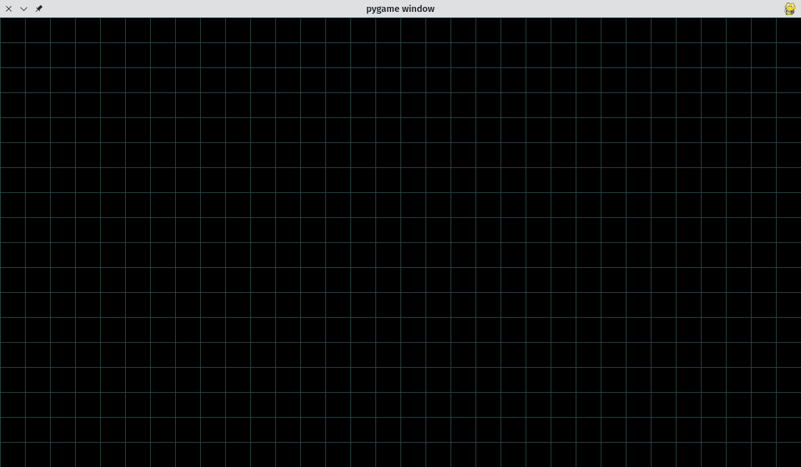
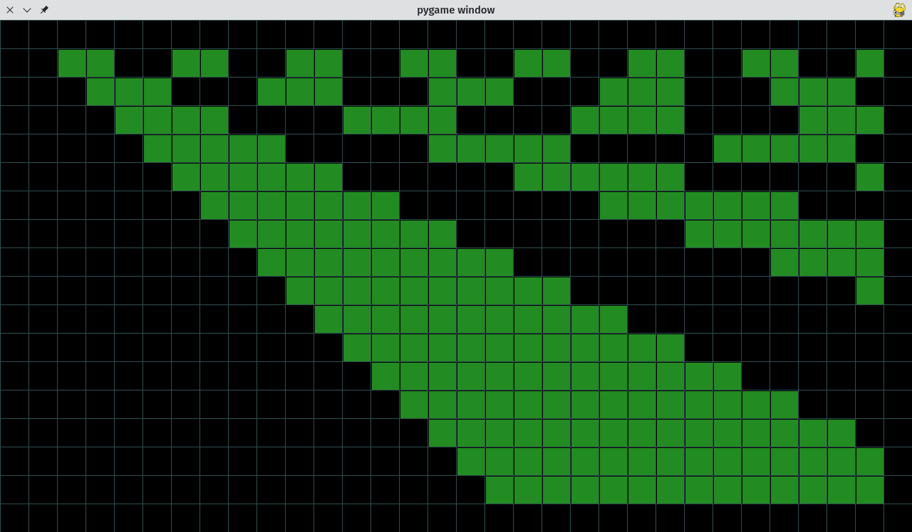
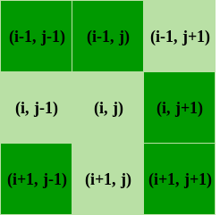
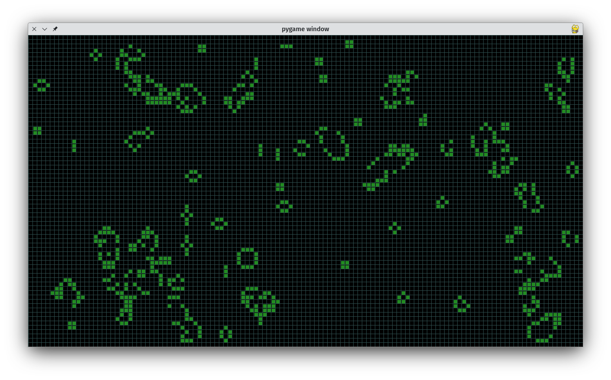

# Pygame of Life

## Conway's Game of Life

## Eerst en vooral

Voor we van start gaan hebben we een aantal zaken nodig. Die zul je op je computer moeten installeren.

### Python

Python zelf uiteraard: [https://www.python.org/downloads/](https://www.python.org/downloads/)

### Editor

Een programma om code te schrijven, dit kan de meegeleverde REPL zijn of een andere editor.

### Pygame installeren

Pygame is een bibliotheek aan code om eenvoudig spelletjes mee te maken, zonder veel code zelf te moeten schrijven.

Je kan dit installeren door in de _commandoprompt_ het volgende in te tikken:

`pip install pygame`

```
pip install pygame
Collecting pygame
  Obtaining dependency information for pygame from https://files.pythonhosted.org/packages/5f/0d/64b84142b477c0d7041bd93a91d4dc6d7901dad4f58323f69779c86757f5/pygame-2.5.2-cp311-cp311-manylinux_2_17_x86_64.manylinux2014_x86_64.whl.metadata
  Downloading pygame-2.5.2-cp311-cp311-manylinux_2_17_x86_64.manylinux2014_x86_64.whl.metadata (13 kB)
Downloading pygame-2.5.2-cp311-cp311-manylinux_2_17_x86_64.manylinux2014_x86_64.whl (14.0 MB)
   ━━━━━━━━━━━━━━━━━━━━━━━━━━━━━━━━━━━━━━━━ 14.0/14.0 MB 18.6 MB/s eta 0:00:00
Installing collected packages: pygame
Successfully installed pygame-2.5.2

[notice] A new release of pip is available: 23.2.1 -> 23.3.1
[notice] To update, run: pip install --upgrade pip
```

## Speelveld

### Import

Om ons speelveld te maken gaan we de code inladen die `pygame` voor ons voorziet.

```python
import pygame
```

### Grootte en snelheid

```python
SCHERM = BREEDTE, HOOGTE = 1280,720
SNELHEID = 10
```

### pygame

```python
pygame.init()
speelveld = pygame.display.set_mode(SCHERM)
klok = pygame.time.Clock()
```

### Spellus

```python
while True:

    speelveld.fill(pygame.Color('black'))
    for event in pygame.event.get():
        if event.type == pygame.QUIT:
            exit()
    
    pygame.display.flip()
    klok.tick(SNELHEID)
```

### Raster

Om het spel duidelijker te kunnen zien gaan we een _raster_ tekenen.
Deze waarde komt vlak na de `SNELHEID` en voor de `pygame.init()` te staan:

- `TEGEL` zal de grootte zijn in pixels van elk vierkantje van de raster

```python
...
SNELHEID = 10
TEGEL = 40

pygame.init()
...
```

Daarna tekenen we de raster.

! let op de insprong van deze lijnen, die moet even ver naar rechts staan als de `pygame.display.flip()`

```python
            ...
            exit()

    [pygame.draw.line(speelveld, pygame.Color('darkslategray'), (x, 0), (x, HOOGTE)) for x in range(0, BREEDTE, TEGEL)]
    [pygame.draw.line(speelveld, pygame.Color('darkslategray'), (0, y), (BREEDTE, y)) for y in range(0, HOOGTE, TEGEL)]
    
    pygame.display.flip()
    ...
```



## Het leven begint

### De eerste fase tekenen

Wij gaan _leven_ voorstellen als groene vierkantjes in de raster.

We nemen het aantal kolommen (`K`) en rijen (`R`) door de `BREEDTE` en `HOOGTE` van het speelveld te delen (`//`) door het aantal pixels van een tegel.

```python
K, R = BREEDTE // TEGEL, HOOGTE // TEGEL
```

De volgende code maakt een raster zo groot als ons speelveld en vult dit op met `0` en `1`.  Let goed op met het overnemen van de formule, een klein foutje is snel gemaakt. Het is een beetje een willekeurige formule die een leuk resultaat geeft.

```python
huidig_veld = [ [(k // (r+1) ) % 2 for k in range(K)] for r in range(R)]
```
```
[
[0, 1, 0, 1, 0, 1, 0, 1, 0, 1, 0, 1, 0, 1, 0, 1, 0, 1, 0, 1, 0, 1, 0, 1, 0, 1, 0, 1, 0, 1, 0, 1],
[0, 0, 1, 1, 0, 0, 1, 1, 0, 0, 1, 1, 0, 0, 1, 1, 0, 0, 1, 1, 0, 0, 1, 1, 0, 0, 1, 1, 0, 0, 1, 1],
[0, 0, 0, 1, 1, 1, 0, 0, 0, 1, 1, 1, 0, 0, 0, 1, 1, 1, 0, 0, 0, 1, 1, 1, 0, 0, 0, 1, 1, 1, 0, 0],
[0, 0, 0, 0, 1, 1, 1, 1, 0, 0, 0, 0, 1, 1, 1, 1, 0, 0, 0, 0, 1, 1, 1, 1, 0, 0, 0, 0, 1, 1, 1, 1],
[0, 0, 0, 0, 0, 1, 1, 1, 1, 1, 0, 0, 0, 0, 0, 1, 1, 1, 1, 1, 0, 0, 0, 0, 0, 1, 1, 1, 1, 1, 0, 0],
[0, 0, 0, 0, 0, 0, 1, 1, 1, 1, 1, 1, 0, 0, 0, 0, 0, 0, 1, 1, 1, 1, 1, 1, 0, 0, 0, 0, 0, 0, 1, 1],
[0, 0, 0, 0, 0, 0, 0, 1, 1, 1, 1, 1, 1, 1, 0, 0, 0, 0, 0, 0, 0, 1, 1, 1, 1, 1, 1, 1, 0, 0, 0, 0],
[0, 0, 0, 0, 0, 0, 0, 0, 1, 1, 1, 1, 1, 1, 1, 1, 0, 0, 0, 0, 0, 0, 0, 0, 1, 1, 1, 1, 1, 1, 1, 1],
[0, 0, 0, 0, 0, 0, 0, 0, 0, 1, 1, 1, 1, 1, 1, 1, 1, 1, 0, 0, 0, 0, 0, 0, 0, 0, 0, 1, 1, 1, 1, 1],
[0, 0, 0, 0, 0, 0, 0, 0, 0, 0, 1, 1, 1, 1, 1, 1, 1, 1, 1, 1, 0, 0, 0, 0, 0, 0, 0, 0, 0, 0, 1, 1],
[0, 0, 0, 0, 0, 0, 0, 0, 0, 0, 0, 1, 1, 1, 1, 1, 1, 1, 1, 1, 1, 1, 0, 0, 0, 0, 0, 0, 0, 0, 0, 0],
[0, 0, 0, 0, 0, 0, 0, 0, 0, 0, 0, 0, 1, 1, 1, 1, 1, 1, 1, 1, 1, 1, 1, 1, 0, 0, 0, 0, 0, 0, 0, 0],
[0, 0, 0, 0, 0, 0, 0, 0, 0, 0, 0, 0, 0, 1, 1, 1, 1, 1, 1, 1, 1, 1, 1, 1, 1, 1, 0, 0, 0, 0, 0, 0],
[0, 0, 0, 0, 0, 0, 0, 0, 0, 0, 0, 0, 0, 0, 1, 1, 1, 1, 1, 1, 1, 1, 1, 1, 1, 1, 1, 1, 0, 0, 0, 0],
[0, 0, 0, 0, 0, 0, 0, 0, 0, 0, 0, 0, 0, 0, 0, 1, 1, 1, 1, 1, 1, 1, 1, 1, 1, 1, 1, 1, 1, 1, 0, 0],
[0, 0, 0, 0, 0, 0, 0, 0, 0, 0, 0, 0, 0, 0, 0, 0, 1, 1, 1, 1, 1, 1, 1, 1, 1, 1, 1, 1, 1, 1, 1, 1],
[0, 0, 0, 0, 0, 0, 0, 0, 0, 0, 0, 0, 0, 0, 0, 0, 0, 1, 1, 1, 1, 1, 1, 1, 1, 1, 1, 1, 1, 1, 1, 1],
[0, 0, 0, 0, 0, 0, 0, 0, 0, 0, 0, 0, 0, 0, 0, 0, 0, 0, 1, 1, 1, 1, 1, 1, 1, 1, 1, 1, 1, 1, 1, 1]
]
```
Nu nul en één zegt ons niet zo veel, het wordt mooier als we dit ook kunnen tekenen op ons speelveld.

```python
	...
    [pygame.draw.line(speelveld, pygame.Color('darkslategray'), (x, 0), (x, HOOGTE)) for x in range(0, BREEDTE, TEGEL)]
    [pygame.draw.line(speelveld, pygame.Color('darkslategray'), (0, y), (BREEDTE, y)) for y in range(0, HOOGTE, TEGEL)]
    
    for x in range(1, K - 1):
        for y in range(1, R - 1):
            if huidig_veld[y][x]:
                pygame.draw.rect(speelveld, pygame.Color('forestgreen'), (x * TEGEL + 2, y * TEGEL + 2, TEGEL - 2, TEGEL - 2))
    
    pygame.display.flip()
	...
```


### De regels van het leven

Een cel in ons raster kan 2 statussen hebben: "AAN" (`1`) of "AF" (`0`). De regels kijken altijd naar een cel in verhouding tot de 8 omliggende cellen. Cellen veranderen van status tussen beurten in, volgens deze 4 regeltjes:

1. Als een cel AAN is en minder dan 2 buren heeft die ook AAN zijn, gaat de cel AF
2. Als een cel AAN is en 2 of 3 buren heeft die AAN zijn, blijft de cel AAN
3. Als een cel AAN is meer dan 3 buren heeft die AAN zijn, gaat de cel AF
4. Als een cel AF is en exact 3 buren heeft die AAN zijn, gaat de cel AAN



In python code wordt dit dan als volgt geschreven. Voor elke cel in `huidig_veld` wordt volgens de positie `x` en `y` gekeken naar de status van de omliggende buren. Als de status AAN ofwel `1` is, wordt de teller `aantal_buren` met 1 verhoogd. Dit geheel is wat een functie genoemd wordt.

`... + 2` ziet er vreemd uit, maar dat is omdat `range()` telt "tot" dat getal en niet "tot en met" dat getal.

Eenmaal we het aantal actieve buren hebben, kijken we naar de status van de cel zelf en hoeveel buren er actief zijn. Aan de hand daarvan passen we de status van de cel zelf aan.

```python
def regels(huidig_veld, x, y):
    aantal_buren = 0
    for j in range(y - 1, y + 2):
        for i in range(x - 1, x + 2):
            if huidig_veld[j][i]:
                aantal_buren += 1

    if huidig_veld[y][x]:
        aantal_buren -= 1
        if aantal_buren == 2 or aantal_buren == 3:
            return 1
        return 0
    else:
        if aantal_buren == 3:
            return 1
        return 0
```

### De regels toepassen

We starten met een volledige leeg veld voor de volgende "beurt":
```python
volgend_veld= [[0 for k in range(K)] for r in range(R)]
```
Tijdens het tekenen van het huidige veld, passen we ook de regels toe voor het volgende veld:
```python
volgend_veld[y][x] = regels(huidig_veld, x, y)
```
Daarna kopiëren we het volgende veld naar het huidige speelveld. Dit gebeurt nadat alles getekend werd.
```python
from copy import deepcopy
# Het 'volgende' veld wordt nu het 'huidige' veld
huidig_veld = deepcopy(volgend_veld)
```

Voor de duidelijkheid het complete programma van voor naar achter:
```python
import pygame
from copy import deepcopy

SCHERM = BREEDTE, HOOGTE = 1280,720
SNELHEID = 10
TEGEL = 40
K, R = BREEDTE // TEGEL, HOOGTE // TEGEL

pygame.init()
speelveld = pygame.display.set_mode(SCHERM)
klok = pygame.time.Clock()

huidig_veld = [[(k + r) % 2 for k in range(K-1)] for r in range(R-1)]
volgend_veld= [[0 for k in range(K)] for r in range(R)]

def regels(huidig_veld, x, y):
    aantal_buren = 0
    for j in range(y - 1, y + 2):
        for i in range(x - 1, x + 2):
            if huidig_veld[j][i]:
                aantal_buren += 1

    if huidig_veld[y][x]:
        aantal_buren -= 1
        if aantal_buren == 2 or aantal_buren == 3:
            return 1
        return 0
    else:
        if aantal_buren == 3:
            return 1
        return 0

while True:

    speelveld.fill(pygame.Color('black'))
    for event in pygame.event.get():
        if event.type == pygame.QUIT:
            exit()

    [pygame.draw.line(speelveld, pygame.Color('darkslategray'), (x, 0), (x, HOOGTE)) for x in range(0, BREEDTE, TEGEL)]
    [pygame.draw.line(speelveld, pygame.Color('darkslategray'), (0, y), (BREEDTE, y)) for y in range(0, HOOGTE, TEGEL)]
    
    for x in range(1, K - 1):
        for y in range(1, R - 1):
            if huidig_veld[y][x]:
                pygame.draw.rect(speelveld, pygame.Color('forestgreen'), (x * TEGEL + 2, y * TEGEL + 2, TEGEL - 2, TEGEL - 2))
            volgend_veld[y][x] = regels(huidig_veld, x, y)
    
    # Het 'volgende' veld wordt nu het 'huidige' veld
    huidig_veld = deepcopy(volgend_veld)
    
    pygame.display.flip()
    klok.tick(SNELHEID)

```

### Willekeurige start

Bovenaan importeren we de keuzefunctie `choice` die ons zal toelaten een willekeurige `1` of `0` te kiezen:
```python
from random import choice
```
Daarna passen we de lijn aan die het initiële veld maakt:
```python
huidig_veld = [[choice([0, 1]) for k in range(K)] for r in range(R)]
```

### Kleinere cellen of snellere evolutie

Speel eens met de waarde van `TEGEL`, probeer bijvoorbeeld eens 20 of 10.

Speel ook eens met de waarde van `SNELHEID`, probeer dit eens hoger te zetten om snellere evolutie te krijgen.



> Bronvermelding:
> 
> Dit spelletje is gebaseerd op https://github.com/StanislavPetrovV/Python-Game-of-life/ (MIT licentie). Dezelfde code werd gebruikt in een Youtube video: https://www.youtube.com/watch?v=lk1_h2_GLv8