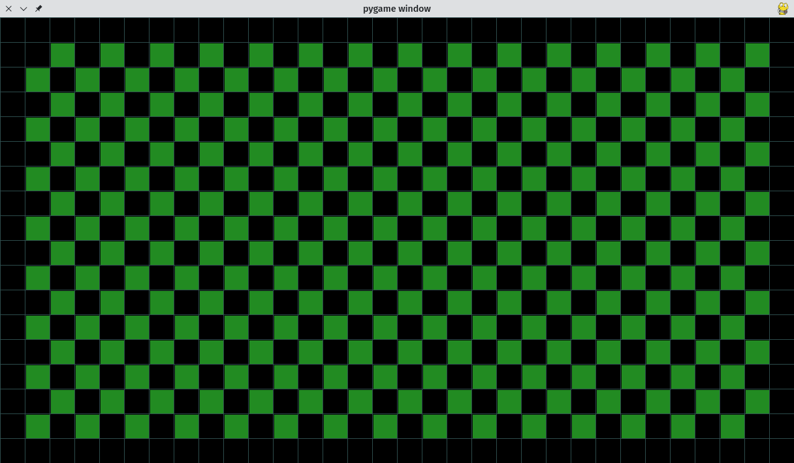

# Pygame of Life

## Conway's Game of Life

## Eerst en vooral

Voor we van start gaan hebben we een aantal zaken nodig. Die zul je op je computer moeten installeren.

### Python

Python zelf uiteraard: [https://www.python.org/downloads/](https://www.python.org/downloads/)

### Editor

Een programma om code te schrijven, dit kan de meegeleverde REPL zijn of een andere editor.

### Pygame installeren

Pygame is een bibliotheek aan code om eenvoudig spelletjes mee te maken, zonder veel code zelf te moeten schrijven.

Je kan dit installeren door in de _commandoprompt_ het volgende in te tikken:

`pip install pygame`

```
pip install pygame
Collecting pygame
  Obtaining dependency information for pygame from https://files.pythonhosted.org/packages/5f/0d/64b84142b477c0d7041bd93a91d4dc6d7901dad4f58323f69779c86757f5/pygame-2.5.2-cp311-cp311-manylinux_2_17_x86_64.manylinux2014_x86_64.whl.metadata
  Downloading pygame-2.5.2-cp311-cp311-manylinux_2_17_x86_64.manylinux2014_x86_64.whl.metadata (13 kB)
Downloading pygame-2.5.2-cp311-cp311-manylinux_2_17_x86_64.manylinux2014_x86_64.whl (14.0 MB)
   ━━━━━━━━━━━━━━━━━━━━━━━━━━━━━━━━━━━━━━━━ 14.0/14.0 MB 18.6 MB/s eta 0:00:00
Installing collected packages: pygame
Successfully installed pygame-2.5.2

[notice] A new release of pip is available: 23.2.1 -> 23.3.1
[notice] To update, run: pip install --upgrade pip
```

## Speelveld

### Import

Om ons speelveld te maken gaan we de code inladen die `pygame` voor ons voorziet.

```python
import pygame
```

### Grootte en snelheid

```python
SCHERM = BREEDTE, HOOGTE = 1280,720
SNELHEID = 10
```

### pygame

```python
pygame.init()
speelveld = pygame.display.set_mode(SCHERM)
klok = pygame.time.Clock()
```

### Spellus

```python
while True:

    speelveld.fill(pygame.Color('black'))
    for event in pygame.event.get():
        if event.type == pygame.QUIT:
            exit()
    
    pygame.display.flip()
    klok.tick(SNELHEID)
```

### Raster

Om het spel duidelijker te kunnen zien gaan we een _raster_ tekenen.
Deze waarde komt vlak na de `SNELHEID` en voor de `pygame.init()` te staan:

- `TEGEL` zal de grootte zijn in pixels van elk vierkantje van de raster

```python
...
SNELHEID = 10
TEGEL = 40

pygame.init()
...
```

Daarna tekenen we het raster.

! let op de insprong van deze lijnen, die moet even ver naar rechts staan als de `pygame.display.flip()`

```python
            ...
            exit()

    [pygame.draw.line(speelveld, pygame.Color('darkslategray'), (x, 0), (x, HOOGTE)) for x in range(0, BREEDTE, TEGEL)]
    [pygame.draw.line(speelveld, pygame.Color('darkslategray'), (0, y), (BREEDTE, y)) for y in range(0, HOOGTE, TEGEL)]
    
    pygame.display.flip()
    ...
```


## Het leven begint

### De eerste fase tekenen

Wij gaan _leven_ voorstellen als groene vierkantjes in de raster.

We nemen het aantal kolommen (`K`) en rijen (`R`) door de `BREEDTE` en `HOOGTE` van het speelveld te delen (`//`) door het aantal pixels van een tegel.

```python
K, R = BREEDTE // TEGEL, HOOGTE // TEGEL
```

De volgende code maakt een raster _bijna_ zo groot als ons speelveld en vult dit op met `0` en `1`. De reden is dat we later een lege rand rondom willen laten.

```python
huidig_veld = [[(k + r) % 2 for k in range(K-1)] for r in range(R-1)]
```
```
[
[0, 1, 0, 1, 0, 1, 0, 1, 0, 1, 0, 1, 0, 1, 0, 1, 0, 1, 0, 1, 0, 1, 0, 1, 0, 1, 0, 1, 0, 1],
[1, 0, 1, 0, 1, 0, 1, 0, 1, 0, 1, 0, 1, 0, 1, 0, 1, 0, 1, 0, 1, 0, 1, 0, 1, 0, 1, 0, 1, 0],
[0, 1, 0, 1, 0, 1, 0, 1, 0, 1, 0, 1, 0, 1, 0, 1, 0, 1, 0, 1, 0, 1, 0, 1, 0, 1, 0, 1, 0, 1],
[1, 0, 1, 0, 1, 0, 1, 0, 1, 0, 1, 0, 1, 0, 1, 0, 1, 0, 1, 0, 1, 0, 1, 0, 1, 0, 1, 0, 1, 0],
[0, 1, 0, 1, 0, 1, 0, 1, 0, 1, 0, 1, 0, 1, 0, 1, 0, 1, 0, 1, 0, 1, 0, 1, 0, 1, 0, 1, 0, 1],
[1, 0, 1, 0, 1, 0, 1, 0, 1, 0, 1, 0, 1, 0, 1, 0, 1, 0, 1, 0, 1, 0, 1, 0, 1, 0, 1, 0, 1, 0],
[0, 1, 0, 1, 0, 1, 0, 1, 0, 1, 0, 1, 0, 1, 0, 1, 0, 1, 0, 1, 0, 1, 0, 1, 0, 1, 0, 1, 0, 1],
[1, 0, 1, 0, 1, 0, 1, 0, 1, 0, 1, 0, 1, 0, 1, 0, 1, 0, 1, 0, 1, 0, 1, 0, 1, 0, 1, 0, 1, 0],
[0, 1, 0, 1, 0, 1, 0, 1, 0, 1, 0, 1, 0, 1, 0, 1, 0, 1, 0, 1, 0, 1, 0, 1, 0, 1, 0, 1, 0, 1],
[1, 0, 1, 0, 1, 0, 1, 0, 1, 0, 1, 0, 1, 0, 1, 0, 1, 0, 1, 0, 1, 0, 1, 0, 1, 0, 1, 0, 1, 0],
[0, 1, 0, 1, 0, 1, 0, 1, 0, 1, 0, 1, 0, 1, 0, 1, 0, 1, 0, 1, 0, 1, 0, 1, 0, 1, 0, 1, 0, 1],
[1, 0, 1, 0, 1, 0, 1, 0, 1, 0, 1, 0, 1, 0, 1, 0, 1, 0, 1, 0, 1, 0, 1, 0, 1, 0, 1, 0, 1, 0],
[0, 1, 0, 1, 0, 1, 0, 1, 0, 1, 0, 1, 0, 1, 0, 1, 0, 1, 0, 1, 0, 1, 0, 1, 0, 1, 0, 1, 0, 1],
[1, 0, 1, 0, 1, 0, 1, 0, 1, 0, 1, 0, 1, 0, 1, 0, 1, 0, 1, 0, 1, 0, 1, 0, 1, 0, 1, 0, 1, 0],
[0, 1, 0, 1, 0, 1, 0, 1, 0, 1, 0, 1, 0, 1, 0, 1, 0, 1, 0, 1, 0, 1, 0, 1, 0, 1, 0, 1, 0, 1],
[1, 0, 1, 0, 1, 0, 1, 0, 1, 0, 1, 0, 1, 0, 1, 0, 1, 0, 1, 0, 1, 0, 1, 0, 1, 0, 1, 0, 1, 0]
]
```
Nu nul en één zegt ons niet zo veel, het wordt mooier als we dit ook kunnen tekenen op ons speelveld.

```python
	...
    [pygame.draw.line(speelveld, pygame.Color('darkslategray'), (x, 0), (x, HOOGTE)) for x in range(0, BREEDTE, TEGEL)]
    [pygame.draw.line(speelveld, pygame.Color('darkslategray'), (0, y), (BREEDTE, y)) for y in range(0, HOOGTE, TEGEL)]
    
    for x in range(1, K - 1):
        for y in range(1, R - 1):
            if huidig_veld[y][x]:
                pygame.draw.rect(speelveld, pygame.Color('forestgreen'), (x * TEGEL + 2, y * TEGEL + 2, TEGEL - 2, TEGEL - 2))
    
    pygame.display.flip()
	...
```



Bronvermelding:

Dit spelletje is gebaseerd op https://github.com/StanislavPetrovV/Python-Game-of-life/ (MIT licentie). Dezelfde code werd gebruikt in een Youtube video: https://www.youtube.com/watch?v=lk1_h2_GLv8